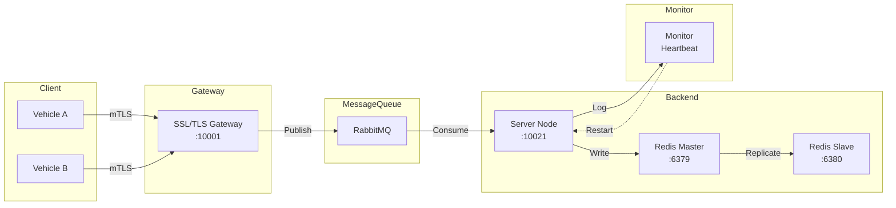

# 🚗 Secure Vehicle Management System

> A fault-tolerant, distributed vehicle management platform with end-to-end encryption, message queue-based load balancing, and self-healing capabilities.

[](https://www.python.org/)
[](LICENSE)
[](https://github.com/psf/black)

---

## 🌟 Features

| Feature | Description |
|---------|-------------|
| 🔒 **End-to-End Encryption** | TLS/mTLS + RSA-AES hybrid encryption + SHA-256 integrity |
| 📬 **Async Messaging** | RabbitMQ-based load balancing and message queuing |
| 💾 **High Availability** | Redis master-slave replication with auto-failover |
| 🔄 **Self-Healing** | Log-based heartbeat monitoring with auto-restart |
| 🔬 **Quantum-Resilient** | Research on post-quantum cryptography migration |

## 🏗️ Architecture



## 🔐 Security Model

```
┌─────────────────────────────────────────────────────────────────────┐
│                    Security Architecture                            │
├─────────────────────────────────────────────────────────────────────┤
│                                                                     │
│  Layer 1: Transport    TLS 1.3 Mutual Authentication                │
│              │           Client <──────> Gateway                    │
│              │              │                                      │
│  Layer 2: Key Exchange  RSA-2048 + OAEP + SHA-256                   │
│              │           AES Key Encrypted with RSA                 │
│              │              │                                      │
│  Layer 3: Data          AES-128 (Fernet) Encryption                │
│              │           Symmetric Encryption for Data             │
│              │              │                                      │
│  Layer 4: Integrity    SHA-256 HMAC                                 │
│                         Message Hash Verification                  │
│                                                                     │
└─────────────────────────────────────────────────────────────────────┘
```

## 📊 System Metrics

| Metric | Value | Description |
|--------|-------|-------------|
| **Availability** | 99.64% | System uptime percentage |
| **MTTR** | < 6 sec | Mean Time To Recovery |
| **Heartbeat Interval** | 5 sec | Server health check interval |
| **Monitor Interval** | 6 sec | Auto-restart detection threshold |

## 🚀 Quick Start

### Prerequisites

- Python 3.9+
- Docker & Docker Compose (for containerized deployment)
- RabbitMQ 3.x
- Redis 7.x

### Installation

```bash
# Clone the repository
git clone https://github.com/YOUR_USERNAME/secure-vehicle-management.git
cd secure-vehicle-management

# Create virtual environment
python -m venv venv
source venv/bin/activate  # Linux/Mac
.\venv\Scripts\activate   # Windows

# Install dependencies
pip install -r requirements.txt

# Copy and configure environment
cp .env.example .env
# Edit .env with your credentials

# Generate SSL certificates
bash scripts/generate_certs.sh
```

### Running with Docker Compose

```bash
cd docker
docker-compose up -d

# View logs
docker-compose logs -f

# Stop services
docker-compose down
```

### Running Locally (Development)

```bash
# Terminal 1: Start RabbitMQ & Redis
# (Ensure these services are running on default ports)

# Terminal 2: Start Gateway
python -m src.gateway

# Terminal 3: Start Server
python -m src.server --port 10021

# Terminal 4: Start Monitor
python -m src.monitor

# Terminal 5: Start Client
python -m src.client --node_name vehicle_a
```

## 🧪 Testing

```bash
# Run all tests
pytest tests/ -v

# Run with coverage
pytest tests/ --cov=src --cov-report=html

# Run specific test
pytest tests/test_client.py -v
```

## 📁 Project Structure

```
secure-vehicle-management/
├── src/                      # Source code
│   ├── __init__.py
│   ├── client.py            # Vehicle client node
│   ├── gateway.py           # SSL/TLS gateway
│   ├── server.py            # Backend server
│   ├── monitor.py           # Health monitor
│   └── utils/               # Utility modules
│       ├── __init__.py
│       ├── config.py        # Configuration management
│       ├── crypto.py        # Cryptographic functions
│       └── parsing.py       # Message parsing
├── configs/                  # Configuration files
│   ├── config.yaml          # Main configuration
│   └── logging.yaml         # Logging configuration
├── certs/                    # SSL/TLS certificates
├── tests/                   # Test suite
│   ├── test_client.py
│   ├── test_gateway.py
│   ├── test_server.py
│   └── integration/
├── docker/                   # Docker configuration
│   ├── Dockerfile.*
│   └── docker-compose.yml
├── scripts/                  # Utility scripts
│   ├── generate_certs.sh
│   └── demo_*.sh
├── docs/                     # Documentation
├── .env.example              # Environment template
├── requirements.txt
├── pyproject.toml
└── README.md
```

## 🎯 Usage Examples

### Vehicle Client Commands

```bash
# Connect to gateway and send location
python -m src.client --node_name vehicle_a
> location
Enter new location: Ottawa, ON
> lock
> unlock
> status
> quit
```

### Gateway Remote Control

```bash
# Send commands to vehicles via gateway
# (In gateway terminal)
Enter vehicle name: vehicle_a
Enter action: lock
Enter message: remote_lock
```

## 🔬 Quantum-Resilient Research

This project includes research on migrating to post-quantum cryptography standards:

- **CRYSTALS-Kyber** (Key Encapsulation Mechanism)
- **CRYSTALS-Dilithium** (Digital Signatures)
- **Hybrid Encryption** for seamless migration

See [docs/QUANTUM_RESEARCH.md](docs/QUANTUM_RESEARCH.md) for details.

## 🗺️ Roadmap

- [ ] **Phase 1**: Integrate NIST Post-Quantum Standards (Kyber/Dilithium)
- [ ] **Phase 2**: Kubernetes deployment with Horizontal Pod Autoscaler
- [ ] **Phase 3**: Web Dashboard with Flask/Dash for real-time monitoring
- [ ] **Phase 4**: GraphQL API for flexible data querying

## 📝 License

MIT License - see [LICENSE](LICENSE) for details.

## 👤 Author

**Your Name**
- GitHub: [@your_username](https://github.com/your_username)
- LinkedIn: [Your LinkedIn](https://linkedin.com/in/your_username)

---

⭐ Star this project if you find it helpful!